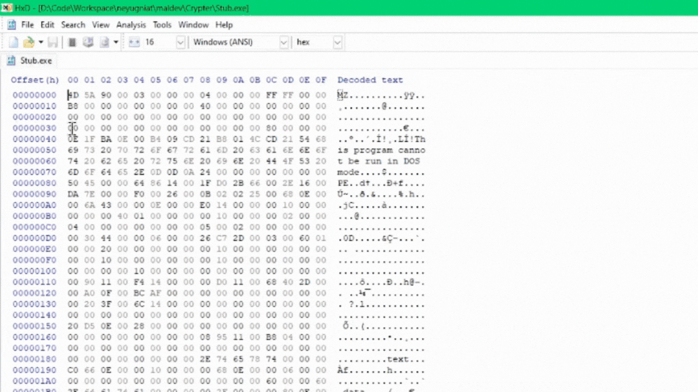
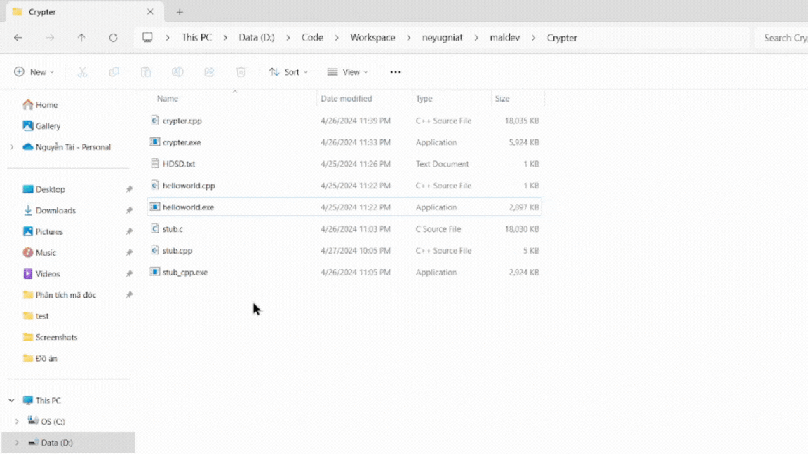
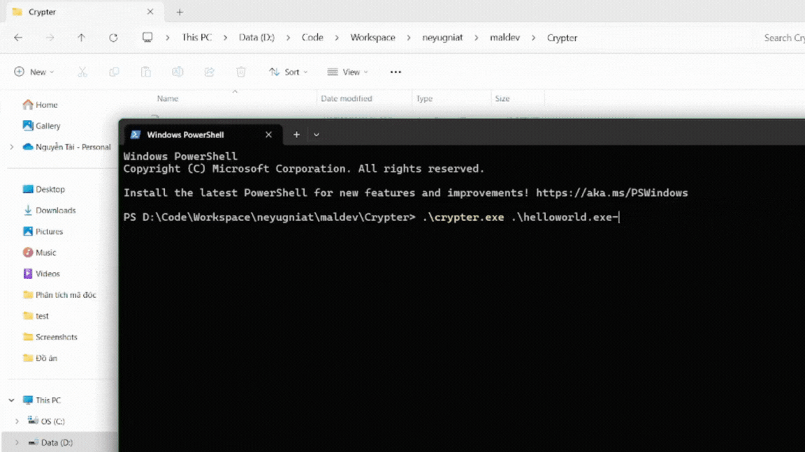

-   Build stub.cpp trước -> stub.exe đổi tên thành stub_cpp.exe cho khỏi trùng
-   Dùng tool để lấy mã hex của stub_cpp.exe, ở đây dùng HxD để export ra file stub.c

-   copy toàn bộ mảng char trong stub.c vào crypter.cpp
-   build crypter.cpp -> crypter.exe
-   kéo thả file exe vào crypter.exe

-   Hoặc có thể dùng cmd:
    C:\path\to\crypter.exe C:\path\to\target.exe

-> ra file stub.exe là file malware
